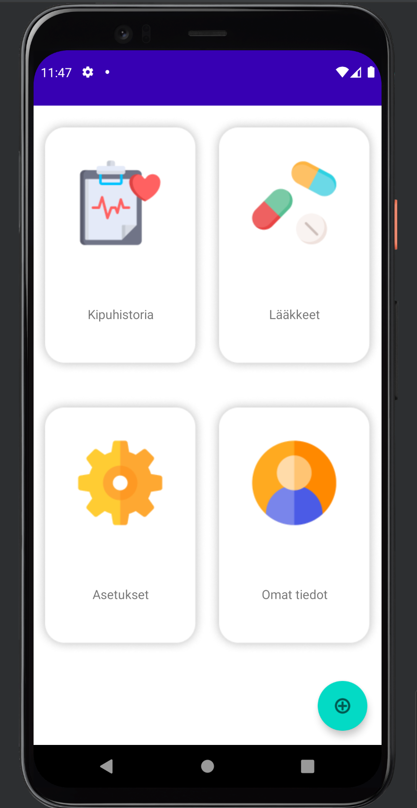

<div id="top"></div>

<!-- PROJECT SHIELDS -->
<!--
*** https://www.markdownguide.org/basic-syntax/#reference-style-links
-->
[![Contributors][contributors-shield]][contributors-url]
[![Issues][issues-shield]][issues-url]
[![MIT License][license-shield]][license-url]


<!-- PROJECT LOGO -->
<br />
<div align="center">
  <a href="https://github.com/ericaskari/health-application">
    
  </a>

<h3 align="center">Health Check Application</h3>

  <p align="center">
    An awesome application to track your health status
    <br />
    <a href="https://github.com/ericaskari/health-application"><strong>Explore the docs »</strong></a>
    <br />
    <br />
    <a href="https://github.com/ericaskari/health-application">View Demo</a>
    ·
    <a href="https://github.com/ericaskari/health-application/issues">Report Bug</a>
    ·
    <a href="https://github.com/ericaskari/health-application/issues">Request Feature</a>
  </p>
</div>


<!-- TABLE OF CONTENTS -->
<details>
  <summary>Table of Contents</summary>
  <ol>
    <li>
      <a href="#about-the-project">About The Project</a>
      <ul>
        <li><a href="#built-with">Built With</a></li>
      </ul>
    </li>
    <li>
      <a href="#getting-started">Getting Started</a>
      <ul>
        <li><a href="#prerequisites">Prerequisites</a></li>
        <li><a href="#installation">Installation</a></li>
      </ul>
    </li>
    <li><a href="#usage">Usage</a></li>
    <li><a href="#roadmap">Roadmap</a></li>
    <li><a href="#contributing">Contributing</a></li>
    <li><a href="#license">License</a></li>
    <li><a href="#contact">Contact</a></li>
    <li><a href="#acknowledgments">Acknowledgments</a></li>
  </ol>
</details>


<!-- ABOUT THE PROJECT -->
<!--## About The Project -->


### Built With


* [Android Studio](https://developer.android.com/studio)
* [Java](https://www.java.com/en/)


<!-- GETTING STARTED -->
## Getting Started

### Prerequisites

You need Android Studio to open this project _[Get Android Studio](https://developer.android.com/studio)_


### Installation

1. Clone the repo
   ```sh
   git clone https://github.com/ericaskari/health-application.git
   ```
2. Open the project in Android Studio


<!-- USAGE EXAMPLES -->
## Usage

Use this space to show useful examples of how a project can be used. Additional screenshots, code examples and demos work well in this space. You may also link to more resources.

_For more examples, please refer to the [Documentation](https://github.com/ericaskari/health-application)_


<!-- ROADMAP -->
## Roadmap

- [x] Add Changelog
- [x] Add Database
- [x] Add Initial Activities
- [x] Add Dashboard Activity
- [x] Add Core functionality
- [x] Style the application
- [x] Multi-language Support
    - [x] Finnish
    - [x] English

See the [open issues](https://github.com/ericaskari/health-application/issues) for a full list of proposed features (and known issues).

<!-- CONTRIBUTING -->
## Contributing
No information is available.

<!-- LICENSE -->
## License

Distributed under the MIT License. See `LICENSE.txt` for more information.


<!-- CONTACT -->
## Contact
Please create an issue if contact information is needed.

[//]: # (Your Name - [@your_twitter]&#40;https://twitter.com/your_username&#41; - email@example.com)
[//]: # (Project Link: [https://github.com/your_username/repo_name]&#40;https://github.com/your_username/repo_name&#41;)


<!-- ACKNOWLEDGMENTS -->
## Acknowledgments

[//]: # (Use this space to list resources you find helpful and would like to give credit to. I've included a few of my favorites to kick things off!)

* [Img Shields](https://shields.io)
* [flaticon](https://www.flaticon.com)


<!-- MARKDOWN LINKS & IMAGES -->
<!-- https://www.markdownguide.org/basic-syntax/#reference-style-links -->
[contributors-shield]: https://img.shields.io/github/contributors/ericaskari/health-application.svg?style=for-the-badge
[contributors-url]: https://github.com/ericaskari/health-application/graphs/contributors
[stars-url]: https://github.com/ericaskari/health-application/stargazers
[issues-shield]: https://img.shields.io/github/issues/ericaskari/health-application?style=for-the-badge
[issues-url]: https://github.com/ericaskari/health-application/issues
[license-shield]: https://img.shields.io/github/license/ericaskari/health-application.svg?style=for-the-badge
[license-url]: https://github.com/ericaskari/health-application/blob/main/LICENSE.txt

<p align="right">(<a href="#top">back to top</a>)</p>
